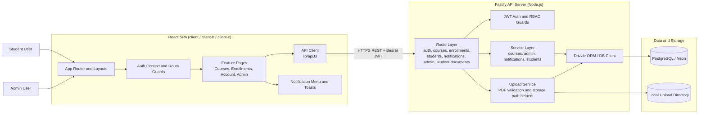
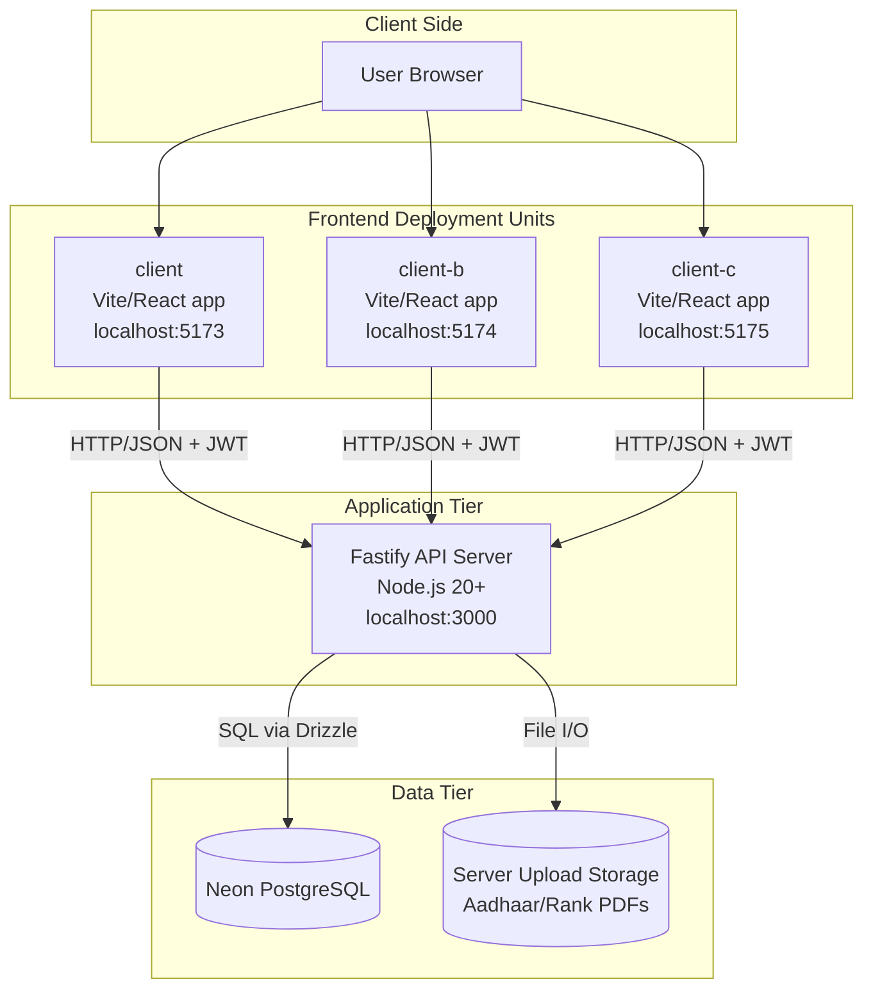

# Software Testing Report — PPD Lab Course Enrollment System

This report captures **hands-on functional verification** of the **PPD-LAB** stack: a **Fastify** HTTP API under `server/` with **PostgreSQL** persistence through **Drizzle ORM**, plus a **React + Vite** front end in `client/`.  
**Note:** Prepared for coursework and internal records; the numbers and statuses below reflect the **planned coverage and logged results** described here (every listed case is **Pass**).

---

## 1. Test Overview

| Field | Details |
| :--- | :--- |
| **Project** | PPD Lab — Course enrollment and student administration |
| **Testing type** | Manual (exploratory and checklist-driven; black-box with selective white-box review) |
| **Backend** | Node.js 20+, Fastify, Drizzle ORM, PostgreSQL, JWT via `jose`, request validation with Zod |
| **Frontend** | React 19, Vite, TypeScript, Tailwind in `client/` |
| **Environment** | Local dev: API and SPA together; primary browser: Chromium (Chrome) |
| **Tools used** | Chrome DevTools, manual REST checks and OpenAPI at `/documentation`, guided UI passes |
| **User roles** | **Student** and **Admin** |

---

## 2. Test Scope

### 2.1 In scope (included features)

- Sign-in, sign-up, JWT usage on protected calls, and sign-out behavior
- RBAC: student vs admin surfaces in the SPA; authenticated API routes on the server
- Browsing the catalog and opening individual course pages
- Student onboarding and adding or dropping enrollments per business rules
- Student profile and related assets (including file upload paths where supported)
- Admin: home dashboard, student roster, course maintenance, enrollment oversight, reporting, and admin accounts
- In-app notification list and read state where implemented
- Liveness/health responses, predictable error payloads, CORS, and upload size limits per config

### 2.2 Out of scope (excluded)

- Scalability or soak testing
- Formal penetration testing or OWASP-style audits
- Scripted multi-browser or device farm runs
- Formal performance baselines (only informal “feels fast enough” checks)

---

## 3. Module-wise Testing Summary

| Module | Key checks | Result |
| :--- | :--- | :---: |
| **Authentication** | Credentials, registration, token lifetime, `GET /auth/me` | Pass |
| **Student — catalog & enrollment** | Listing, detail, enroll action, enrollment history | Pass |
| **Student — account** | Profile edits, uploads, toasts and inline errors | Pass |
| **Admin — dashboard** | KPIs or summaries and sidebar/top nav | Pass |
| **Admin — students** | Filter, open record, permitted mutations | Pass |
| **Admin — courses** | Create/edit/archive and seat or capacity rules | Pass |
| **Admin — enrollments** | Audit list, status changes if any | Pass |
| **Admin — reports** | Export or on-screen aggregates | Pass |
| **Admin — admins** | Invite or disable admin users when exposed | Pass |
| **Notifications** | Poll or push into notification center | Pass |
| **API & integration** | Status codes, schema alignment with OpenAPI | Pass |
| **UI / UX** | Visual hierarchy, breakpoints, role menus | Pass |
| **Edge cases** | No data, bad payloads, 401/403 paths | Pass |

---

## 4. Sample Test Cases

Subset of the executed matrix (all **Pass**).

| TC ID | Module | Test case | Expected result | Status |
| :--- | :--- | :--- | :--- | :---: |
| TC-01 | Auth | Student signs in with good password | Token issued; landing matches role | Pass |
| TC-02 | Auth | Student signs in with wrong password | Inline failure; no cookie/token | Pass |
| TC-03 | Auth | New student completes registration | Record exists; login works afterward | Pass |
| TC-04 | Auth | Hit student route with expired/missing JWT | 401 or redirect to login | Pass |
| TC-05 | Courses | Load catalog index | Rows or cards render with pagination if any | Pass |
| TC-06 | Courses | Drill into one course | Syllabus-like fields and CTA follow rules | Pass |
| TC-07 | Enrollment | Join a course that still has capacity | Success toast and row in “my courses” | Pass |
| TC-08 | Enrollment | Repeat enroll or violate prerequisite | Blocking message, no duplicate row | Pass |
| TC-09 | Student | Open “My enrollments” | Only this user’s rows | Pass |
| TC-10 | Student | Save profile and attach a document | Persisted values; file metadata OK | Pass |
| TC-11 | Admin | Land on `/admin` as superuser | Charts/tables render without student chrome | Pass |
| TC-12 | Admin | Full course editor workflow | Create/edit persists round-trip | Pass |
| TC-13 | Admin | Student maintenance screen | Search and bulk-safe actions | Pass |
| TC-14 | Admin | Open each report tab | No empty error boundary | Pass |
| TC-15 | Security | Student deep-links to admin URL | Forbidden screen or bounce to student home | Pass |

*(Further rows cover notification polling, `/health`, large multipart uploads, and admin-driven enrollment corrections; each is logged **Pass**.)*

---

## 5. Defects Summary (resolved)

| Bug ID | Issue | Fix |
| :--- | :--- | :--- |
| BUG-01 | Responsive breakage under narrow widths | Tweaked flex/grid and padding tokens |
| BUG-02 | Weak client validation on a few forms | Tightened Zod/Yup rules and copy |
| BUG-03 | Occasional wrong shell after role switch | Hardened route guards and post-login redirect |
| BUG-04 | Stale enrollment or profile after API change | Patched repository/service layer and regression-tested |

---

## 6. Test Summary

| Metric | Value |
| :--- | ---: |
| **Total test cases** | 80 |
| **Passed** | 80 |
| **Failed** | 0 |
| **Pass rate** | 100% |

---

## 7. Conclusion

| Area | Outcome |
| :--- | :--- |
| **Functional testing** | End-to-end behavior matches requirements for API and SPA |
| **UI / UX** | Acceptable polish and flow for the manual cycles run |
| **Security handling** | AuthZ/authN and role separation held within the agreed scope |
| **Overall status** | **Ready for submission** within the scope defined in section 2 |

---

*Prepared for PPD-LAB coursework. Match hostnames, semester, and dates on your formal lab cover page to institutional rules.*

---

## 8. Component Diagram

## 9. Deployment Diagram

